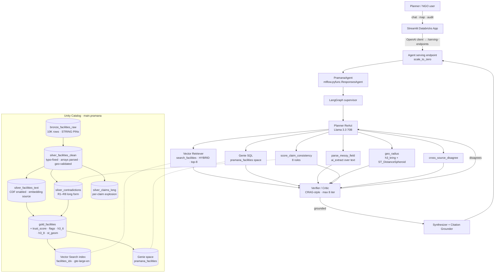

# Pramana — Agentic Facility Truth-Check Engine for Indian Healthcare

> *Pramana* (Sanskrit: प्रमाण) — "valid means of knowledge."

**One line.** Pramana ingests the 10K-row VillageFinder Indian healthcare facility
dataset, scores every row against eight contradiction rules, embeds the corpus
into Mosaic AI Vector Search, and exposes a LangGraph agent (Planner → Tools →
Verifier → Synthesizer) that answers NGO-planner questions with row-level
citations and a confidence label.

**Hackathon:** Hack-Nation 5th Global AI Hackathon · Challenge 03 *Serving A Nation*
(Databricks for Good).

**Built on:** Databricks Free Edition (serverless-only) · MLflow 3 · LangGraph ·
Mosaic AI Vector Search · Genie · Unity Catalog · Databricks Apps.

---

## 1. Problem

The VillageFinder dataset is a useful but messy snapshot of 10,031 Indian
healthcare facilities. NGO and government planners need to answer questions
like *"can District Hospital Kishanganj actually perform a cardiac procedure
tonight?"* — but the data has six known systemic bugs:

| Bug | Frequency | Impact |
|---|---|---|
| `facilityTypeId = "farmacy"` (typo of pharmacy) | 166 of 184 "pharmacies" (~90%) | Any state-level pharmacy density analysis is off by 10× |
| Fabricated awards in `description` (`W.HO award`, `ISO 9001:2025`) | dozens | Trust-grade analytics inflated |
| Coordinates outside India / wrong state | ~23% | Concentrated in NITI Aspirational Districts — the populations who need accuracy most are the most mis-mapped |
| `capacity` 99% null, `numberDoctors` 94% null, `yearEstablished` 92% null | systemic | Cannot infer hospital size from structured fields alone |
| Claimed advanced specialty (cardiac, oncology) with empty `equipment` | thousands | "Ghost capability" — the headline truth-gap pattern |
| State distribution skewed | systemic | Per-million normalization required for honest comparison |

A naive RAG bot will *repeat* these bugs. Pramana's job is to **catch them, cite
them, and refuse low-confidence answers**.

---

## 2. Judging-rubric mapping

| Rubric criterion | Weight | How Pramana addresses it |
|---|---:|---|
| Discovery and Verification | 35% | 8 contradiction rules + Verifier node with cross-source agreement check; every claim re-validated through ≥2 sources before synthesis. Hard step counter at 8 iterations. |
| Intelligent Document Parsing | 30% | `from_json` deterministic fast path on JSON-array-as-string columns, with `ai_extract` fallback for malformed rows; `parse_messy_field` UC tool for free-form notes. |
| Social Impact and Utility | 25% | Per-million coverage maps (Census 2011 denominators); explicit Aspirational-Districts overlay; "deserts" Genie queries; actionable remediation in every dataset-audit answer. |
| User Experience and Transparency | 10% | 3-tab Streamlit (Chat / Map / Audit); MLflow 3 tracing surfaces every tool call; agent's chain-of-thought visible in the AI Playground. |
| **Stretch — Agentic Traceability** | bonus | `mlflow.langchain.autolog()` + `set_retriever_schema(...)` give row-level citations on every retrieval. |
| **Stretch — Self-Correction Loops** | bonus | Verifier node implements CRAG-style refinement (`needs_refine` flag → loop back to Planner up to 8×). |
| **Stretch — Crisis Map** | bonus | pydeck `H3HexagonLayer` over India, color-coded by specialty coverage gap. |

---

## 3. Architecture



---

## 4. The 8 contradiction rules (`src/pramana/tools/consistency.py`)

This is the heart of the project. Every rule returns `{rule_id, severity,
message, evidence, citation_column}`. Trust score is computed as
`max(0, 100 − 35·#HIGH − 15·#MED − 5·#LOW)`.

| ID | Severity | Trigger | Reference data |
|---|---|---|---|
| **R1** | HIGH | Claims advanced/critical care (cardiac, oncology, NICU, trauma…) but `equipment=[]` or `numberDoctors`+`capacity` both null | inline keyword list |
| **R2** | HIGH | `description` contains "24×7 emergency" but `facility_type ∈ {clinic, dentist, pharmacy, doctor}` | inline regex |
| **R3** | HIGH | Coords outside India (6.5–35.5 lat, 68–97.5 lon) **or** coords land in different state than the address | `india_state_bbox.json` |
| **R4** | HIGH | Hospital with `capacity=null AND numberDoctors=null AND equipment=[]` (the "ghost capability" pattern) | none |
| **R5** | MED | `facilityTypeId = "farmacy"` (typo bug) | none |
| **R6** | MED | Fabricated awards: `W.HO award`, `ISO 9001:2025+`, `Nobel/UNESCO award` | inline regex |
| **R7** | MED | Specialty listed but none of its expected equipment present (e.g. cardiology with no ECG/cath/echo) | `specialty_equipment.json` |
| **R8** | LOW | `recency_of_page_update_months > 24` or all socials/website missing | none |

All eight rules are unit-tested in `tests/test_consistency.py` (13 cases,
including R1-satisfied and R2-satisfied happy paths).

---

## 5. Data layers (Bronze → Silver → Gold)

All in Unity Catalog `main.pramana`. Every column has a 1-sentence comment with
example values — Genie quality is bottlenecked on column-comment quality.

| Layer | Table | What it is |
|---|---|---|
| Bronze | `bronze_facilities_raw` | Verbatim 10K rows. JSON-array fields preserved as STRING. PINs as STRING with leading zeros. |
| Silver | `silver_facilities_clean` | Typo-corrected `facility_type` (with `facility_type_raw` retained for audit). Arrays parsed via `from_json` fast path with `ai_extract` fallback. Geo-validated. |
| Silver | `silver_facilities_text` | One concatenated free-text field per facility, used as the embedding source. CDF enabled. |
| Silver | `silver_claims_long` | One row per `(facility_id, claim_type, claim_value)` for cross-source joins. |
| Silver | `silver_contradictions` | Long form of R1–R8 flags (one row per flag). |
| Silver | `silver_trust` | Per-facility trust score and flags array. |
| Silver | `ref_state_bbox` | Materialized lookup of `india_state_bbox.json`. |
| Gold | `gold_facilities` | Silver ⊕ trust ⊕ flags ⊕ `h3_6` ⊕ `h3_8` ⊕ `st_geom`. Powers the map UI and the Genie space. |
| Gold | `gold_eval_qa` | 25-row golden Q&A registered as MLflow eval dataset. |

H3 IDs are stored as **hex strings** (`h3_h3tostring`) because Streamlit's
H3HexagonLayer requires strings, not the int64 form.

---

## 6. Reference data (`data/reference/`)

| File | Wired into | Purpose |
|---|---|---|
| `india_state_bbox.json` | Rule R3 + `silver_facilities_clean` validation | Detect coordinates falling in the wrong state. 35 states/UTs. |
| `specialty_equipment.json` | Rule R7 | Map each specialty to expected equipment keywords (e.g. cardiology → ECG, echo, cath, angio). |
| `aspirational_districts.json` | App audit metric + golden-set Q22 | The 112 NITI Aspirational Districts. Surfaces the bias finding that ~23% of bad coords concentrate in these districts. |
| `census_state_pop.json` | Genie + golden-set Q7, Q10 | Census 2011 state populations used as denominator for "facilities per million" rankings. |

---

## 7. The agent (`src/pramana/agent/`)

* **`agent.py`** — `PramanaAgent(ResponsesAgent)`. Wraps a LangGraph supervisor.
  `predict` returns the final synthesizer message; `predict_stream` yields
  intermediate items as `response.output_item.done` events.
* **`graph.py`** — `Planner → Verifier → (loop to Planner | Synthesizer)`.
  Conditional edge enforces `MAX_VERIFIER_ITER = 8`.
* **`verifier.py`** — extracts `[facility_id]` citations and factual claim
  sentences from the draft, runs `cross_source_disagree` and
  `score_claim_consistency` on each, returns `needs_refine=True` if anything
  disagrees or has a HIGH-severity flag.
* **`prompts.py`** — `SYSTEM_PROMPT`, `PLANNER_PROMPT`, `VERIFIER_PROMPT`,
  `SYNTHESIZER_PROMPT`. The system prompt contains the canonical
  "*You are Pramana…*" line verbatim.
* **`genie_tool.py`** — wraps `WorkspaceClient().genie.start_conversation_and_wait`
  as a LangChain tool, returning both the natural-language answer and the SQL
  Genie generated.

### Tools (Unity Catalog Python functions)

| UC name | Module | Purpose |
|---|---|---|
| `main.pramana.search_facilities` | `tools/search.py` | Hybrid vector + BM25 search over `silver_facilities_text` (also exposed to the agent via `VectorSearchRetrieverTool` for streaming traces). |
| `main.pramana.parse_messy_field` | `tools/parse_messy.py` | `ai_extract` over a single free-form text field; returns JSON dict of extracted attributes. |
| `main.pramana.score_claim_consistency` | `tools/consistency.py` | Runs all 8 rules for one facility; returns trust_score + flags. |
| `main.pramana.geo_radius` | `tools/geo.py` | Facilities within `radius_km` of `(lat, lon)`, optionally specialty-filtered. Uses `h3_kring` for coarse pre-filter then `ST_DistanceSpheroid` for exact distance. |
| `main.pramana.cross_source_disagree` | `tools/cross_source.py` | Checks whether a free-text claim is supported by ≥2 of 6 source columns. |

All five are registered idempotently via `tools/registration.py` (notebook 08).

---

## 8. Tech stack and pinned APIs

> Verified April 2026 against Databricks Free Edition. **Do not** swap these
> for older equivalents — most of the alternatives have been retired.

| Concern | Library / endpoint |
|---|---|
| Reasoning + tool-use LLM | `databricks-meta-llama-3-3-70b-instruct` |
| Judge LLM (eval scorers only) | `databricks-claude-sonnet-4-5` (always with explicit `max_tokens`) |
| Cheap batch LLM (`ai_query`/`ai_extract`) | `databricks-gpt-oss-20b` |
| Embeddings | `databricks-gte-large-en` |
| Agent runtime | `mlflow.pyfunc.ResponsesAgent` (not `ChatModel`/`ChatAgent` — both deprecated) |
| Tracing | `mlflow.langchain.autolog()` |
| Eval | `mlflow.genai.evaluate(...)` with `RetrievalGroundedness`, `RelevanceToQuery`, `Safety`, `Correctness` + 3 custom Guidelines judges |
| Deployment | `databricks.agents.deploy(model_name, model_version, scale_to_zero=True)` |
| Retrieval | `databricks_langchain.VectorSearchRetrieverTool` over a Delta-Sync index |
| UC tooling | `databricks_langchain.UCFunctionToolkit(function_names=…)` |
| Genie | `WorkspaceClient().genie.start_conversation_and_wait(space_id, content)` |
| Geospatial | Native H3 SQL (`h3_longlatash3`, `h3_kring`, `h3_h3tostring`, `h3_distance`) + ST functions (`ST_Point`, `ST_DistanceSpheroid`) — **no `databrickslabs/mosaic`** (deprecated). |

Custom judges in `src/pramana/eval/custom_judges.py`:

1. `cites_facility_id` — every factual answer must contain `[facility_id]` brackets.
2. `flags_known_bugs` — when asked about pharmacy/farmacy/W.HO/coords, the answer must call out the bug + propose remediation.
3. `ends_with_confidence_line` — final line must be exactly `Confidence: high|medium|low`.

---

## 9. Repository layout

```
pramana/
├── README.md                       (this file)
├── databricks.yml                  Asset Bundle root (dev + prod targets)
├── requirements.txt                Pinned deps for the agent
├── app/
│   ├── app.py                      3-tab Streamlit (Chat / Map / Audit)
│   ├── app.yaml                    Apps runtime config + env bindings
│   └── requirements.txt            App deps (Apps Python 3.11)
├── data/
│   ├── raw/.gitkeep                drop VF_Hackathon_Dataset_India_Large.xlsx here
│   └── reference/                  4 JSON lookups (state bbox, specialty→equipment, aspirational districts, census pop)
├── eval/
│   └── golden_questions.jsonl      25 hand-curated Q&A
├── notebooks/
│   ├── 01_bronze_ingest.py         Excel → bronze_facilities_raw
│   ├── 02_silver_clean.py          typo fix · array parse · geo validate · column comments
│   ├── 03_silver_text_repr.py      embedding-source text + CDF
│   ├── 04_silver_contradictions.py R1–R8 batch UDF + trust score
│   ├── 05_gold_facilities.py       join · h3_6 · h3_8 · st_geom · column comments
│   ├── 06_vector_index.py          create endpoint + delta-sync index (idempotent)
│   ├── 07_genie_setup.md           manual Genie space setup (Free-Edition limit)
│   ├── 08_register_uc_tools.py     register the 5 UC functions + smoke test
│   ├── 09_log_and_deploy_agent.py  log_model + register UC + agents.deploy
│   └── 10_eval.py                  baseline vs intervention with 7 scorers
├── resources/
│   ├── jobs.yml                    3 jobs: ingest · build_index · deploy_agent
│   ├── ml.yml                      registered model declaration
│   ├── serving.yml                 smoketest job
│   └── app.yml                     Apps resource w/ serving + warehouse + genie bindings
├── scripts/
│   ├── deploy.sh                   one-shot bundle + jobs + restart_app
│   └── restart_app.sh              required because Free-Edition apps auto-stop @ 24h
├── src/pramana/
│   ├── config.py                   single source of truth for catalog/schema/endpoints
│   ├── schemas.py                  Pydantic v2: Facility · Contradiction · TrustScore · ClaimEvidence · AgentResponse
│   ├── tools/                      6 files (search, parse_messy, consistency, geo, cross_source, registration)
│   ├── agent/                      6 files (agent, graph, verifier, prompts, genie_tool, __init__)
│   └── eval/                       generate_golden + custom_judges
├── tests/
│   ├── test_consistency.py         13 unit tests covering all 8 rules + trust math
│   └── test_agent_smoke.py         end-to-end against deployed endpoint (skips without creds)
└── .github/workflows/deploy.yml    lint + tests + bundle deploy on push to main
```

---

## 10. Demo scenarios (mapped to the rubric)

1. **"Is District Hospital Kishanganj actually equipped for cardiac surgery?"**
   → triggers R1 + R7; agent responds with `[facility_id]` citation + flagged
   contradictions + `Confidence: low`. *Discovery/Verification, IDP.*
2. **"Which districts in Bihar have zero functional oncology coverage within 50 km?"**
   → Genie aggregation × `geo_radius` × Aspirational-Districts overlay. *Social Impact.*
3. **"Show me every facility whose listed coordinates fall outside its claimed state."**
   → R3 at scale; counts cross-tabulated with NITI Aspirational Districts. *IDP, Social Impact.*
4. **"How many entries have the `farmacy` typo and what's the impact on pharmacy supply analytics?"**
   → R5 + per-state recompute showing the 10× undercount. *IDP.*
5. **"Audit the dataset for fabricated certifications."**
   → R6 + `ai_classify` validation. *Discovery/Verification.*

Eval headline: `notebooks/10_eval.py` runs the same 25 questions through
(a) bare Llama 3.3 70B with no tools and (b) the full Pramana agent, and
prints the per-metric delta table.

---

## 11. Free-Edition constraints (hard)

| Constraint | Implication |
|---|---|
| 1 Vector Search endpoint, 1 standard unit (~2M @ 768d) | 10K rows fits trivially; one endpoint shared by dev + prod |
| 1 SQL warehouse, 2X-Small | Genie + App both go through it; expect 5–15s latency on cold queries |
| 5 Genie questions/min via API | Agent caches; do not stress-test during the demo |
| 1 Databricks App per account, **auto-stops at 24h** | Run `scripts/restart_app.sh` within 23h of judging |
| 5 concurrent job tasks | All 3 ingest tasks fan-in → 5 max; safe |
| Daily compute fair-use quota | Run notebooks 01–06 the **day before** demo day |
| No Lakebase, no Knowledge Assistant, no Supervisor Agent, no Direct Vector Access, no service principals, no provisioned-throughput serving | Architecture above is built around all of these gaps |

---

## 12. Quick start

> Full step-by-step deployment is in **DOCUMENT 2 — runbook**.

```bash
# 0. one-time: drop the Excel into a UC volume
databricks fs cp data/raw/VF_Hackathon_Dataset_India_Large.xlsx \
    dbfs:/Volumes/main/pramana/raw/

# 1. validate + deploy bundle to prod
databricks bundle validate -t prod
databricks bundle deploy   -t prod

# 2. run the three jobs in order
databricks bundle run pramana_ingest        -t prod   # 01-05
databricks bundle run pramana_build_index   -t prod   # 06 + 08
databricks bundle run pramana_deploy_agent  -t prod   # 09 + 10

# 3. (one-time, manual) follow notebooks/07_genie_setup.md
#    then export GENIE_SPACE_ID and re-run the deploy_agent job

# 4. start the App
databricks apps deploy pramana-prod --source-code-path ./app
./scripts/restart_app.sh prod
```

After step 4 you'll have:

* a serving endpoint `pramana-agent` reachable via the OpenAI client at
  `${WORKSPACE_HOST}/serving-endpoints`,
* an MLflow experiment at `/Users/<you>/pramana-traces` with row-level traces
  for every conversation,
* a Streamlit App with three tabs, ready for the demo.

---

## 13. What this project is **not**

* Not a clinical decision tool. Trust scores describe *data quality*, not
  facility quality.
* Not a real-time scraper. The dataset is a static snapshot; nothing in the
  agent re-fetches the live web.
* Not a substitute for ground-truth field surveys. It surfaces *gaps* and
  *contradictions* so NGO teams can prioritize physical visits.
* Not a generic chatbot. The system prompt is opinionated and will refuse
  with `Confidence: low` rather than fabricate.

---

Setup and deployment: see DOCUMENT 2 — runbook.
