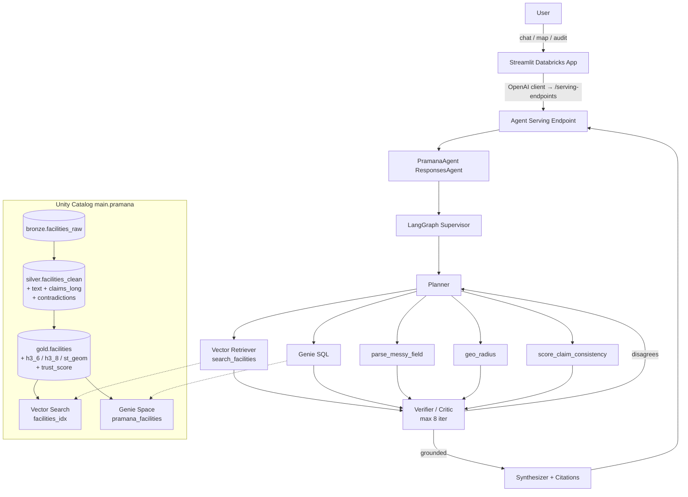

# Pramana — Agentic Facility Truth-Check Engine for Indian Healthcare

> *Pramana* (Sanskrit: प्रमाण) — "valid means of knowledge."

**What:** An agentic system that audits the 10K-row VillageFinder Indian healthcare facility dataset, verifies whether listed capabilities (ICU, oncology, trauma…) are actually backed by equipment and staff, surfaces medical deserts by PIN code, and flags fabricated claims (the "W.HO award" and `farmacy` typo bugs are demos).

**Why:** NGO and government planners need to know which of the 10,000+ listed facilities can *actually* perform a cardiac procedure tonight — not which ones say so on a webpage.

**How (one line):** LangGraph supervisor over Mosaic AI Vector Search + Genie + 5 Unity-Catalog tools, wrapped as an MLflow 3 `ResponsesAgent`, deployed via `databricks.agents.deploy`, fronted by a 3-tab Streamlit Databricks App.

---

## Architecture

## Repo layout

| Path | Purpose |
|---|---|
| `notebooks/01_…10_…` | Bronze→Silver→Gold→Index→Tools→Agent→Eval pipeline |
| `src/pramana/agent/`  | LangGraph + ResponsesAgent |
| `src/pramana/tools/`  | The 5 UC functions (consistency.py is the heart) |
| `src/pramana/eval/`   | Golden-set generator + custom judges |
| `app/`                | Streamlit Databricks App (Chat / Map / Audit) |
| `resources/`          | Asset Bundle: jobs, model, app |
| `eval/golden_questions.jsonl` | 25 hand-curated Q&A |
| `data/reference/`     | India state bbox, specialty→equipment, NITI Aspirational Districts, Census 2011 |

## Demo questions that win the rubric

1. *"Is District Hospital Kishanganj actually equipped for cardiac surgery?"* → R1 + R7 contradictions
2. *"Which districts in Bihar have **zero** functional oncology coverage within 50 km?"* → geo + Genie
3. *"Show me every facility whose listed coordinates fall outside its claimed state."* → R3
4. *"How many entries have the `farmacy` typo and what's the impact on pharmacy supply analytics?"* → R5
5. *"Audit the dataset for fabricated certifications."* → R6 + ai_classify

Setup and deployment: see DOCUMENT 2 — runbook.
